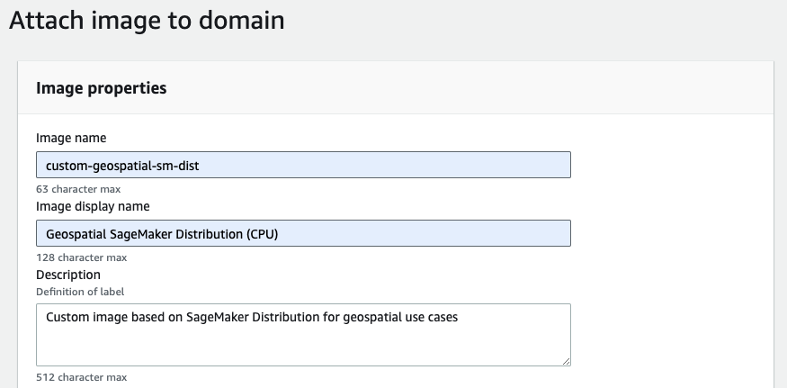

# Custom Geospatial SageMaker Image based on Amazon SageMaker Distribution

This project demonstrates how to extend the [Amazon SageMaker Distribution](https://github.com/aws/sagemaker-distribution) with custom libraries and packages to create a custom container image which can be used within SageMaker. While the example provided focuses on geospatial data science, the methodology presented can be applied to any kind of custom image based on the SageMaker Distribution. The project includes Infrastructure as Code (IaC) components that automate the deployment of an AWS CodeBuild project to construct the custom image, along with an Amazon Elastic Container Registry (ECR) repository for hosting the created image.

The SageMaker Distribution enables machine learning practitioners to get started quickly with their ML development. The pre-built docker  container includes deep learning frameworks such as PyTorch, TensorFlow, and Keras; popular Python packages like numpy, scikit-learn, and pandas; and IDEs such as Jupyter Lab. All included libraries and packages are mutually compatible and updated to their latest compatible versions.

Custom images based on the SageMaker Distribution can serve as an interactive JupyterLab notebook environment in SageMaker Studio UI and also be used in non-interactive workflows like SageMaker Processing or Training jobs. This allows the same runtime to be used across Studio notebooks and SageMaker training, facilitating a seamless transition from local experimentation to batch execution.

## Architecture & Solution Overview

Building a custom image and using it in SageMaker involves the following steps:

1. Create a Dockerfile that extends from the SageMaker Distribution and includes the required geospatial libraries
2. Build the custom image from the Dockerfile
3. Push the custom image to an ECR repository
4. Attach the image to your Amazon SageMaker domain
5. Access the image from your JupyterLab space

This solution uses AWS CodeBuild to have a repeatable way to build the custom image and automatically register the new image versions in the  ECR repository. The solution includes a CDK stack to package the [build assets](assets) as a zip file, upload them to S3 and establishes both a CodeBuild project and an ECR repository.


## Prerequisites & Deployment

### Deploy Container Build Pipeline using CDK

The initial infrastructure can be deployed via the CDK stack in this repository. Follow the steps below to deploy the necessary infrastructure:

1. Clone this repository
2. Navigate to the cloned repository (`cd <path to repository>`)
3. Configure [CLI credentials for your AWS account](https://docs.aws.amazon.com/cli/latest/userguide/cli-chap-configure.html)
4. In the cloned repository, navigate to the deployment folder: `cd deployment`
5. Run `npm i` to install project dependencies
6. If you have not done so already, [bootstrap your environment for CDK deployment](https://docs.aws.amazon.com/cdk/v2/guide/bootstrapping.html#bootstrapping-env) by running `cdk bootstrap aws://ACCOUNT-NUMBER-1/REGION-1`
7. Run the CDK deployment by running `cd deployment && cdk deploy`
8. Wait until the `CustomImageBuildPipelineStack` been marked as `CREATE COMPLETE`
9. Copy the Output value for `CustomImageBuildPipelineStack.CodeBuildProjectUrl`

### Run Build Pipeline

The build pipeline will build the Dockerfile and pushes the created image to the ECR repository which has been created by the CDK scripts in the previous step.

1. In a browser, navigate to the URL displayed in  `CustomImageBuildPipelineStack.CodeBuildProjectUrl`
2. Click on **Start Build**

3. Wait until the build is complete
4. Copy the value of the image URI on ECR from the build logs


You can also find the image URI by navigating to the [ECR console](https://console.aws.amazon.com/ecr), and search for `customimagebuildpipelinestack-geospatialimagerepository` in the repositories. Click on the `latest-cpu` image tag. The image URI is shown in the **Details** section.  

### Setup SageMaker Domain (optional)

If you don't already have a SageMaker Studio Domain created, please follow this [Quickstart guide](https://docs.aws.amazon.com/sagemaker/latest/dg/onboard-quick-start.html) to setup a domain.

### Attach Custom Image to SageMaker Domain

After the image has been pushed to the ECR repository, you need to attach it to the SageMaker domain to be able to use within SageMaker Studio.

1. Open the [SageMaker console](https://console.aws.amazon.com/sagemaker)
2. Under **Admin configurations**, choose **Domains**
3. Select the domain to which you want to attach the image
4. Open the **Environment** tab
5. In the section **Custom images for personal Studio apps**, click on **Attach image**

6. Enter the **ECR image URI** from the build pipeline output and click on **Next**
7. Provide an **Image name** and **Image display name**

8. Select **JupyterLab image** as application type and click on **Submit**


### Use the Custom Geospatial Image in the JupyterLab app

#### Open SageMaker Studio

1. Open the [SageMaker console](https://console.aws.amazon.com/sagemaker)
2. Click on **Studio** in the left navigation pane
3. *Only applies if you have multiple SageMaker Studio domains:* Select the **Domain** you attached the custom image to
4. Select a **User Profile** and click on **Open Studio**
5. SageMaker Studio UI will launch in a new browser tab

#### (Optional) Create a new JupyterLab space

If you don't have any space created, follow the steps below to setup a new space. Otherwise you can also select one of your existing spaces.

1. Select **JupyterLab**
2. Click on **Create JupyterLab space** and enter a name for your new space


#### Start a JupyterLab with the custom image

After you created a new space or selected an existing space, you will be presented with the space details.

1. Select the custom image which you attached to SageMaker Studio as **Image**

2. Click on **Run Space**

This will open a JupyterLab app in a new browser tab.

## Examples: Run Interactive Geospatial Data Analyses and Large-Scale Processing Jobs in SageMaker

Once the Custom Geospatial Image has been built and attached to your SageMaker Domain, you can use it in one of two main ways:

1. First, you can use the image as the base to run a JupyterLab Notebook kernel to perform __in-Notebook interactive development__. 
2. Second, you can use the image in a SageMaker Processing Job to run __highly-parallelized geospatial processing pipelines__. 

We will briefly explain both options below. Also refer to the example notebook in the `notebooks` folder of this repository for tutorials on both approaches.

### In-Notebook interactive development using custom image

> See `/notebooks/01-interactive-geospatial-analyses-custom-image.ipynb` for a walk-though example.

Using the Custom Geospatial Image in a Jupyter app gives you access to many common geospatial libraies. For example, you can readily specify and plot a polygon inside the Jupyter Notebook using the code below without the need to install any of the specialist libraries used.

```python
import shapely
import leafmap
import geopandas

coords = [[-102.00723310488662,40.596123257503024],[-102.00723310488662,40.58168585757733],[-101.9882214495914,40.58168585757733],[-101.9882214495914,40.596123257503024],[-102.00723310488662,40.596123257503024]]
polgyon = shapely.Polygon(coords)
gdf = geopandas.GeoDataFrame(index=[0], crs='epsg:4326', geometry=[polgyon])

Map = leafmap.Map(center=[40.596123257503024, -102.00723310488662], zoom=13)
Map.add_basemap("USGS NAIP Imagery")
Map.add_gdf(gdf, layer_name="test", style={"color": "yellow", "fillOpacity": 0.3, "clickable": True,})
Map
```

Below is another example that plots Band-2 of a Sentinel-2 scene clipped to the above-specified Polygon (`coords`) inside a notebook environment.


### Highly Parallelized Geospatial Processing Pipelines using SageMaker Processing Job

> See `/notebooks/02-geospatial-processing-custom-image.ipynb` for a walk-though example.

You can specify the custom image as the image to run a [SageMaker Processing Job](https://docs.aws.amazon.com/sagemaker/latest/dg/processing-job.html). This enables you to leverage specialist geospatial processing frameworks to run large-scale distributed data processing pipelines with just a few lines of code. The below code snippet initializes and then runs a SageMaker `ScriptProcessor` object that leverages the Custom Geospatial Image (`geospatial_image_uri`) to run a geospatial processing routine (specified in the `scripts/generate_aoi_data_cube.py`) on 20 `ml.m5.2xlarge` instances.

```python
import sagemaker
from sagemaker import get_execution_role
from sagemaker.sklearn.processing import ScriptProcessor
from sagemaker.processing import ProcessingInput, ProcessingOutput

region = sagemaker.Session().boto_region_name
role = get_execution_role()

geospatial_image_uri = "<GEOSPATIAL-IMAGE-URI>" #<-- set to uri of the custom geospatial image

processor_geospatial_data_cube = ScriptProcessor(
    command=['python3'],
    image_uri=geospatial_image_uri,
    role=role,
    instance_count=20,
    instance_type='ml.m5.2xlarge',
    base_job_name='aoi-data-cube'
)

processor_geospatial_data_cube.run(
    code='scripts/generate_aoi_data_cube.py', #<-- processing script
    inputs=[
        ProcessingInput(
            source=f"s3://{bucket_name}/{bucket_prefix_aoi_meta}/",
            destination='/opt/ml/processing/input/aoi_meta/', #<-- meta data (incl. geography) of the area of observation
            s3_data_distribution_type="FullyReplicated" #<-- sharding strategy for distribution across nodes
        ),        
        ProcessingInput(
            source=f"s3://{bucket_name}/{bucket_prefix_sentinel2_meta}/",
            destination='/opt/ml/processing/input/sentinel2_meta/', #<-- Sentinel-2 scene metadata (1 file per scene)
            s3_data_distribution_type="ShardedByS3Key" #<-- sharding strategy for distribution across nodes
        ),
    ],
    outputs=[
        ProcessingOutput(
            source='/opt/ml/processing/output/',
            destination=f"s3://{bucket_name}/processing/geospatial-data-cube/{execution_id}/output/" #<-- output S3 path
        )
    ]
)
```

Running a typical processing routine involving raster file loading, clipping to an AOI, resampling specific bands and masking clouds among other steps (see `/notebooks/02-geospatial-processing-custom-image.ipynb`) across 134 110x110km Sentinel-2 scenes completes in under 15 minutes as can be seen in the below CloudWatch dashboard. 


## Security

See [CONTRIBUTING](CONTRIBUTING.md#security-issue-notifications) for more information.

## License

This library is licensed under the MIT-0 License. See the LICENSE file.

